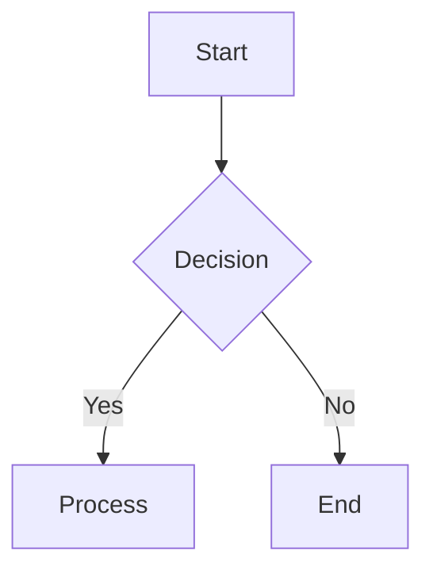

# MarkdownViewer

A WPF-based Markdown viewer with Mermaid diagram and KaTeX math rendering support, designed for seamless integration with PowerShell.

## Features

- **Markdown Rendering** - Full CommonMark support via [Markdig](https://github.com/xoofx/markdig)
- **Mermaid Diagrams** - Flowchart, Sequence, Class, State, ER, Gantt, Pie, Git graph, Mindmap
- **KaTeX Math** - Inline and block math expressions
- **Multi-Tab Interface** - Open multiple files with drag-and-drop tab reordering
- **Tab Detachment** - Drag tabs to create new windows or transfer between windows
- **File Watching** - Auto-reload on file changes
- **Pointing Mode** - Click elements to copy source line references
- **PowerShell Integration** - Control via `Show-MarkdownViewer` cmdlet

## Requirements

- Windows 10/11
- .NET 8.0 Runtime
- PowerShell 7.x (for module integration)

## Installation

### Build from Source

```powershell
# Clone and build
git clone https://github.com/yotsuda/MarkdownViewer.git
cd MarkdownViewer
dotnet build MarkdownViewer\MarkdownViewer.App.csproj -c Release

# Deploy (runs build and copies to PowerShell module directory)
.\Build-Deploy.ps1
```

### Manual Installation

Copy the contents of `Module\` to your PowerShell module path:

```
C:\Program Files\PowerShell\7\Modules\MarkdownViewer\
├── bin\
│   ├── MarkdownViewer.exe
│   ├── MarkdownViewer.dll
│   ├── Markdig.dll
│   └── ... (other dependencies)
├── MarkdownViewer.psd1
├── MarkdownViewer.psm1
└── LICENSE
```

## Usage

### PowerShell Module

```powershell
# Import module (auto-imported if in module path)
Import-Module MarkdownViewer

# Open a file
Show-MarkdownViewer .\README.md

# Open and scroll to specific line
Show-MarkdownViewer .\README.md -Line 50

# Open multiple files
Get-ChildItem *.md | Show-MarkdownViewer

# Render Markdown content directly
"# Hello World`n`nThis is **bold** text." | Show-MarkdownViewer

# Render with custom title
@"
# Report
| Item | Value |
|------|-------|
| CPU  | 80%   |
"@ | Show-MarkdownViewer -Title "System Report"

# List open tabs
Get-MarkdownViewerTab
```

### Keyboard Shortcuts

| Shortcut | Action |
|----------|--------|
| `Ctrl+O` | Open file |
| `Ctrl+W` | Close current tab |
| `Ctrl+Tab` | Next tab |
| `Ctrl+Shift+Tab` | Previous tab |
| `Ctrl+1-9` | Switch to tab 1-9 |
| `F5` | Reload current file |

### UI Controls

- **📌** Toggle always-on-top
- **✋** Toggle scroll/pan mode
- **👆** Toggle pointing mode (click to copy element references)
- **VS Code** Open current file in VS Code

## Mermaid Support

All major Mermaid diagram types are supported with source line tracking:



## KaTeX Support

Inline math with `$...$` and block math with `$$...$$`:

The quadratic formula is $x = \frac{-b \pm \sqrt{b^2 - 4ac}}{2a}$.

$$
\int_{-\infty}^{\infty} e^{-x^2} dx = \sqrt{\pi}
$$

## Project Structure

```
MarkdownViewer/
├── MarkdownViewer/          # WPF Application
│   ├── MainWindow.xaml      # Main UI
│   ├── MainWindow.*.cs      # Partial classes (TabManagement, EventHandlers, DragDrop)
│   ├── Models/              # Data models
│   ├── Services/            # HtmlGenerator, ClipboardService
│   └── Resources/           # CSS, JS resources
├── Module/                  # PowerShell module
│   ├── MarkdownViewer.psd1
│   └── MarkdownViewer.psm1
├── Build-Deploy.ps1         # Build and deploy script
└── README.md
```

## License

MIT License
