# Mermaid ポインティングモード検証

## 1. Flowchart (基本)

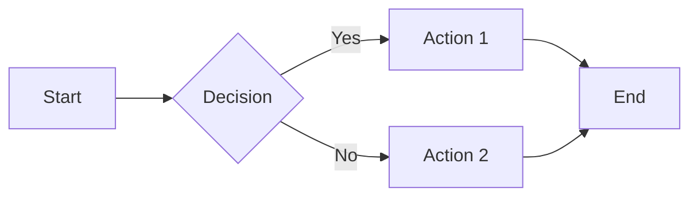

## 2. Flowchart (複雑)

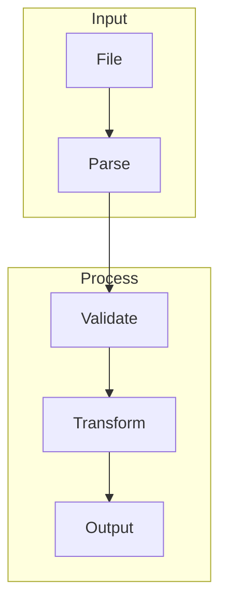

## 3. Sequence Diagram

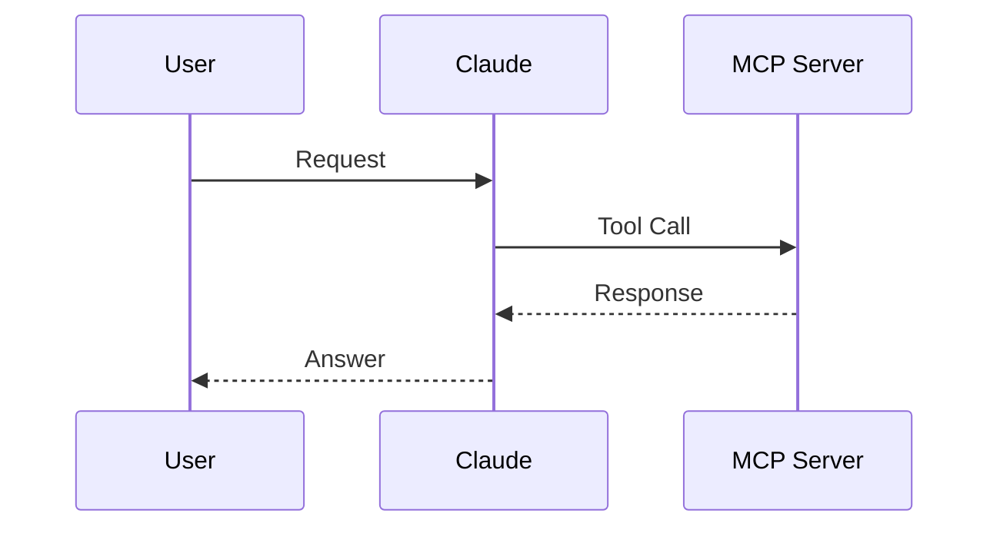

## 4. Class Diagram

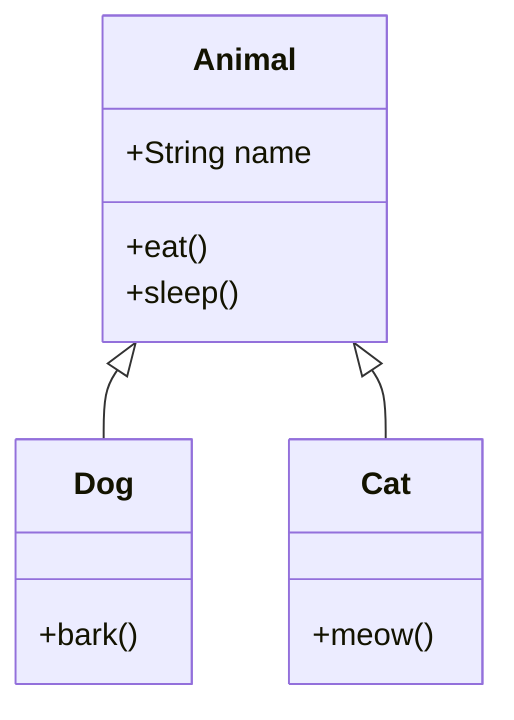

## 5. State Diagram

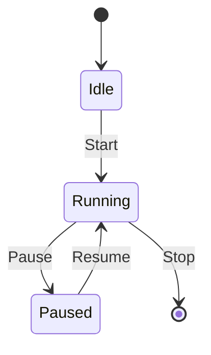

## 6. ER Diagram

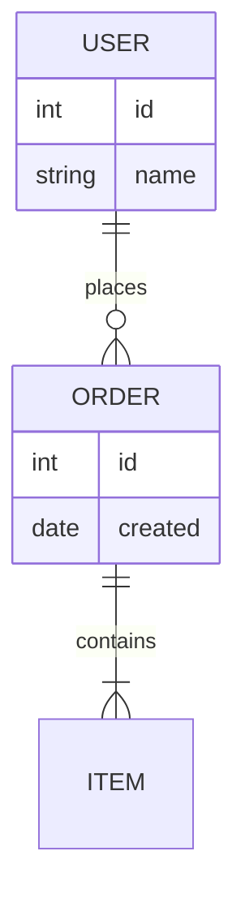

## 7. Gantt Chart

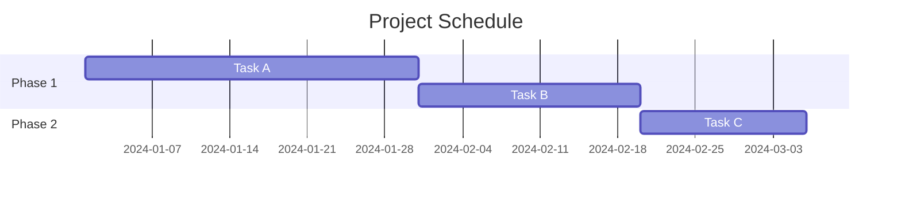

## 8. Pie Chart

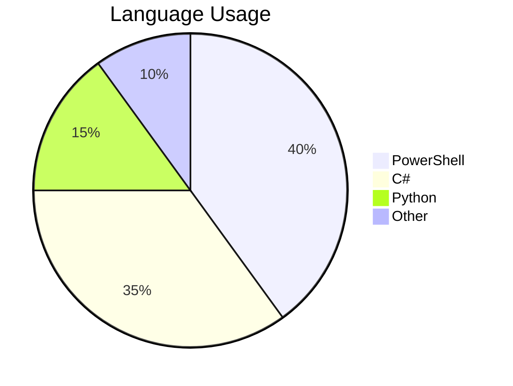

## 9. Git Graph

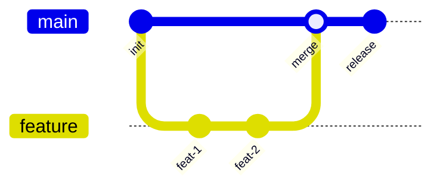

## 10. Mindmap

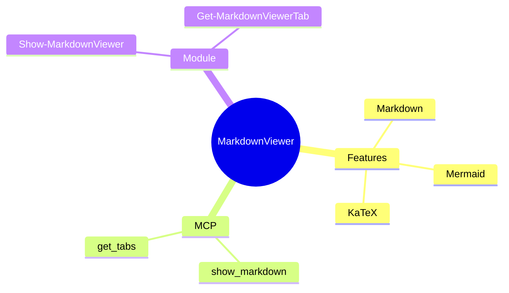

## 11. 小さいノード

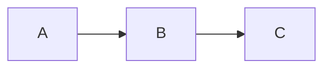

## 12. 長いテキスト

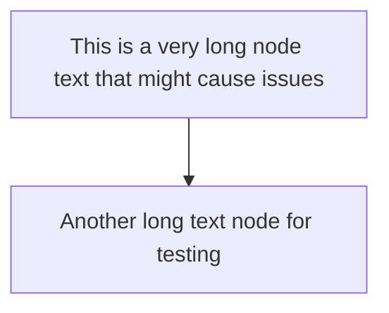
