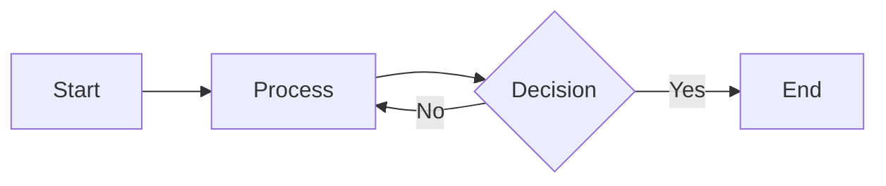

# Markdown テスト

これは**太字**で、これは*斜体*です。

## コードブロック

```csharp
public class Hello 
{
    public static void Main() 
    {
        Console.WriteLine("Hello, World!");
    }
}
```

## リスト

- アイテム1
- アイテム2
  - ネストしたアイテム
- アイテム3

## テーブル

| 列1 | 列2 | 列3 |
|-----|-----|-----|
| A   | B   | C   |
| 1   | 2   | 3   |

## リンク

[GitHub](https://github.com)

> これは引用です。
> 複数行もOKです。

## Mermaid



## 数式

インライン数式: $E = mc^2$

ブロック数式:

$$
\int_0^\infty e^{-x^2} dx = \frac{\sqrt{\pi}}{2}
$$
